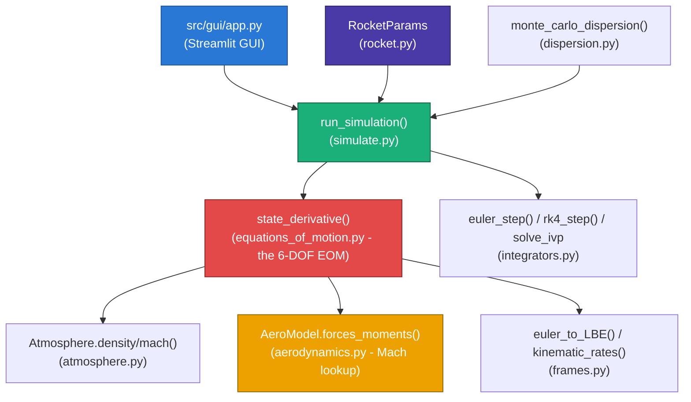

# RocketDynamicsLab

[](https://github.com/timeout187/RocketDynamicsLab/actions/workflows/tests.yml)
[](https://www.python.org/downloads/)
[](LICENSE)
[](https://rocketdynamicslab.streamlit.app/)

**A 6-DOF fin-stabilized artillery rocket flight-dynamics lab**, built as a
teaching companion to a published research paper's model and case study —
for numerical-methods and flight-dynamics education, not operational use.

> **Teaching tool only.** No target-coordinate input, aim correction,
> fire-control capability, or weapon-deployment advice of any kind. Not
> validated for real-world use, and several coefficient values are
> reconstructed teaching data rather than the source paper's exact
> published numbers — see [Assumptions and limitations](#assumptions-and-limitations).

**🚀 [Try the live lab — rocketdynamicslab.streamlit.app](https://rocketdynamicslab.streamlit.app/)**
— nothing to install.

**📖 [Course site & documentation — timeout187.github.io/RocketDynamicsLab](https://timeout187.github.io/RocketDynamicsLab/)**
— syllabus, the math, and every assignment.

---

## Table of contents

1. [What is this?](#what-is-this)
2. [Key features](#key-features)
3. [Architecture](#architecture)
4. [Physics model](#physics-model)
5. [Project structure](#project-structure)
6. [Installation](#installation)
7. [Usage](#usage)
8. [Validation against the published paper](#validation-against-the-published-paper)
9. [Assumptions and limitations](#assumptions-and-limitations)
10. [Learn more](#learn-more)
11. [References](#references)
12. [Credits](#credits)
13. [License](#license)

---

## What is this?

RocketDynamicsLab simulates the full 6-degree-of-freedom flight of a
122&nbsp;mm unguided, fin-stabilized artillery rocket — position, velocity,
spin, and pitch/yaw motion — from muzzle to ground impact, teaching the
model, case-study data, and dispersion methodology of a real, published
paper (see [Credits](#credits)). It ships with a browser-based GUI covering
ten separate lab topics, a full test suite, and nine graduate-level
assignments, and is explicitly designed to teach **methodology** (the math,
the numerical integration, the software architecture) rather than to
reproduce a real-world case study bit-for-bit.

## Key features

| Feature | Description |
|---|---|
| **Interactive GUI** | Single-page Streamlit dashboard: full rocket/initial-condition/atmosphere/solver sidebar, a live-editable Table 1 aero data grid (upload/reset/download CSV), 3D trajectory + 7 time-history plots, CSV/JSON export, and a joint Monte Carlo dispersion sweep |
| **Real 6-DOF rigid-body dynamics** | Full translational + rotational equations of motion in body axes, not a simplified point-mass model |
| **Table 1 aerodynamics, as published** | Axial force (active/passive), normal force, roll damping, pitch/yaw damping, and pitching-moment slope transcribed directly from the paper's Table 1, Mach-interpolated |
| **US Standard Atmosphere 1976** | Altitude-varying temperature, pressure, density, and speed of sound (troposphere + lower stratosphere) |
| **Three integrators** | Hand-written forward Euler and classical RK4, plus adaptive `scipy.integrate.solve_ivp` (RK45), built for direct side-by-side comparison |
| **Monte Carlo dispersion analysis** | Joint sweep of the paper's Table 2 uncertainty parameters (launch angle, mass, inertia, thrust, burn time, air density, spin rate...) reporting the actual impact-point scatter, plus a one-at-a-time sweep API for reproducing Figs. 10-21 |
| **Nine graduate-level assignments** | Deriving the equations by hand, implementing RK4, comparing against `solve_ivp`, timestep-sensitivity/instability investigation, and reproducing the paper's own figures — see `docs/assignments.md` |
| **CI-tested** | 23 pytest tests (frame transforms, atmosphere physics, integrator convergence order, full-trajectory behavior, the general Izx cross-inertia Euler's Equation, rotating-Earth navigation, dispersion) run on every push |

## Architecture



**Data flow**: the GUI (or a script) builds a `RocketParams` instance from
defaults plus any edited inputs → `run_simulation()` dispatches to the
chosen integrator → at every step, `state_derivative()` queries the
atmosphere and aero model for the current altitude/Mach/angle-of-attack,
sums thrust, aerodynamic forces/moments, and gravity, resolves them through
the current attitude via `frames.py`, and returns the 12-element state
derivative → the integrator stops at ground impact (altitude ≤ 0) and
returns the full time history as a `SimulationResult`.

## Physics model

### State vector (12 elements)

| Index | Variable | Description | Frame |
|---|---|---|---|
| 0-2 | u, v, w | Velocity (axial, side, normal) | Body-fixed |
| 3-5 | p, q, r | Angular rates (roll, pitch, yaw) | Body-fixed |
| 6-8 | φ, θ, ψ | Euler angles (roll, pitch/inclination, yaw/azimuth) | — |
| 9-11 | N, E, D | Position (North, East, Down) | Local geodetic (NED) |

Body axes are used because the rocket's moments of inertia (`Ixx, Iyy,
Izz`) are constant in that frame — a rigid body's mass distribution doesn't
change relative to itself as it tumbles. See
[`docs/coordinate-systems.md`](docs/coordinate-systems.md) and
[`docs/equations.md`](docs/equations.md) for the full derivation.

### Translational dynamics (Eq. 1)

```
u_dot = Tx/m - g*sin(theta) - Q*w + R*v
v_dot = Ty/m + g*cos(theta)*sin(phi) - R*u + P*w
w_dot = Tz/m + g*cos(theta)*cos(phi) - P*v + Q*u
```

### Rotational dynamics (Euler's equations, axisymmetric body: Iyy = Izz)

```
p_dot = L / Ixx
q_dot = (M - (Ixx - Izz)*r*p) / Iyy
r_dot = (N - (Iyy - Ixx)*p*q) / Izz
```

The `(Ixx-Izz)*r*p` / `(Iyy-Ixx)*p*q` terms are the **gyroscopic coupling**:
for a spinning fin-stabilized body they couple pitch and yaw into a bounded
"coning"/epicyclic wobble instead of an independent runaway in each plane.
This coupling — and how fast a fixed-step integrator must resolve it near
launch, when spin rate is highest — is the crux of the timestep-sensitivity
assignment; see [`docs/equations.md`](docs/equations.md) and
[`docs/numerical-methods.md`](docs/numerical-methods.md).

### Aerodynamic forces and moments

Given dynamic pressure `q_bar = 0.5*rho*V^2`, reference area `S`, caliber
`D`, angle of attack `alpha`, and sideslip `beta`:

```
Axial force (drag)   = -q_bar * S * CA
Normal force          = -q_bar * S * CN_alpha * alpha
Side force            =  q_bar * S * CN_alpha * beta
Roll moment           =  q_bar * S * D * Cl_p * (p*D / 2V)
Pitch moment          =  q_bar * S * D * (Cm_alpha*alpha + Cmq*q*D/2V)
Yaw moment            =  q_bar * S * D * (Cm_alpha*beta  + Cmq*r*D/2V)
```

`CA`, `CN_alpha`, `Cl_p`, `Cmq`, and `Cm_alpha` are Mach-indexed
coefficients modeled on the source paper's Table 1 (Missile-Datcom-derived
data). **`Cm_alpha` is strongly negative** — the defining feature of a
fin-stabilized (as opposed to spin-stabilized) projectile: the fins create
a strong "weathercock" restoring moment independent of spin rate. See
[`docs/aerodynamic-model.md`](docs/aerodynamic-model.md) for what every
coefficient means physically, and the important caveat on where these
values diverge from the paper's own numbers.

### Atmosphere

| Layer | Altitude | Model |
|---|---|---|
| Troposphere | 0-11 km | Linear lapse rate, `T = 288.15 - 0.0065*h` |
| Lower stratosphere | 11-20 km | Isothermal, `T = 216.65 K` |

Per the **US Standard Atmosphere 1976**; density and speed of sound follow
from the ideal gas law and `a = sqrt(gamma * R * T)`. See
[`docs/atmosphere-model.md`](docs/atmosphere-model.md).

## Project structure

```
FM04.pdf              the required-reading source paper
src/simulator/
  rocket.py            mass/inertia properties, boost vs. free-flight phase
  atmosphere.py        US Standard Atmosphere 1976 (density, sonic speed, Mach)
  aerodynamics.py      Mach-indexed coefficients -> forces/moments
  frames.py            Euler angles, L_BE direction cosine matrix
  equations_of_motion.py   the 6-DOF equations of motion (the physics core)
  integrators.py       Euler, RK4, solve_ivp wrappers, ground-impact event
  simulate.py          orchestration: run_simulation() -> SimulationResult
  dispersion.py        Monte Carlo dispersion sweep (paper's Table 2)
src/visualization/     reusable Plotly figure builders
src/gui/
  app.py               single-page Streamlit dashboard (sidebar + editable aero table + plots)
docs/
  course-notes.md       syllabus and reading order
  mathematical-model.md the five modeling assumptions, state vector
  coordinate-systems.md  frames, Euler angles, gimbal lock
  equations.md           every term of every equation, explained
  numerical-methods.md   Euler vs. RK4 vs. solve_ivp, convergence, stability
  atmosphere-model.md    the atmosphere layers in full
  aerodynamic-model.md   what each coefficient means, and the data caveat
  uncertainty-analysis.md  Table 2 dispersion methodology
  assignments.md         nine graduate-level exercises
  instructor-guide.md    7-session schedule, rubric, known pitfalls
examples/              four ready-to-run standalone scripts
tests/                 23 tests: frames, atmosphere, integrators, simulate, equations of motion, dispersion
assets/                static, hand-authored diagrams
.github/workflows/     CI (pytest on every push)
```

## Installation

Requires **Python 3.11+**.

```bash
git clone https://github.com/timeout187/RocketDynamicsLab.git
cd RocketDynamicsLab
pip install -r requirements.txt
pytest tests/ -q   # optional: verify the install, ~25s
```

## Usage

### GUI (recommended)

```bash
streamlit run src/gui/app.py
```

Opens at `http://localhost:8501`. Set rocket properties, initial conditions,
atmosphere/wind, solver settings, and dispersion parameters in the sidebar;
edit the Table 1 aerodynamic coefficients directly in the data grid (or
upload/download a CSV); click **Run simulation** for a 3D trajectory, seven
time-history plots, an impact-point summary, and CSV/JSON export; check
**Run dispersion sensitivity sweep** for a joint Monte Carlo impact-point
scatter. Or just use the hosted version:
**[rocketdynamicslab.streamlit.app](https://rocketdynamicslab.streamlit.app/)**.

⚠️ **Numerical note:** this system's pitch/yaw dynamics are stiff near
launch (fast gyroscopic coning from the paper's own Table 1 coefficients).
The default timestep (`dt=0.002s`) is chosen for stability — pushing it
above ~0.005s can diverge, which is itself the subject of Assignment
Exercise 3. See `docs/numerical-methods.md`.

### Command line

```bash
python examples/run_nominal_trajectory.py             # the default case, summary output
python examples/timestep_sensitivity.py                # Euler vs. RK4 across six timesteps
python examples/rk4_vs_solve_ivp.py                    # fixed-step RK4 vs. adaptive solve_ivp
python examples/dispersion_sweep.py "Air density"      # one Table-2 dispersion sweep
```

### Python API

```python
import sys; sys.path.insert(0, "src")
from simulator import run_simulation, RocketParams

rocket = RocketParams(mass_total=66.0, mean_thrust=23600.0)  # change anything
result = run_simulation(rocket=rocket, elevation_deg=50.0, dt=0.002, method="rk4")
print(f"time of flight: {result.time_of_flight:.1f} s, range: {result.impact_range:.0f} m")
```

### Tests

```bash
pytest tests/ -q
```

23 tests across coordinate frames, atmosphere physics, integrator
convergence order, full-trajectory behavior, the general (Izx) Euler's
Equation and rotating-Earth navigation, and dispersion — runs on every
push via GitHub Actions.

## Validation against the published paper

The source paper's own worked example uses a 50° firing angle; running
this simulator at the same angle with its default 122&nbsp;mm case:

| Quantity | Paper (Sec. 3.3, exact text, at 50°) | This simulator (50°, Table 1 as published) |
|---|---|---|
| Initial axial acceleration | "35.4 g" | ~35.7 g (0.8% error) |
| Burn-out velocity (t=1.67s) | "705 m/s" | ~717 m/s (1.7% error) |
| Summit time | "nearly 36 sec" | ~36 s |
| Muzzle velocity | 26.7 m/s | 26.7 m/s (exact — input parameter) |

**The boost-phase numbers the paper states as exact text now match to
within ~2%.** Late-flight attitude behavior (spin history, angle of attack
over the full ~90s flight) is a documented, explainable limitation rather
than a silent discrepancy: Table 1's rotational-damping columns are
genuinely ambiguous in the source PDF (its header row and column
boundaries are lost to OCR), and reproducing the paper's spin-up (Fig. 7)
requires a fin-cant roll-drive coefficient the table doesn't publish at
all — see [Assumptions and limitations](#assumptions-and-limitations) and
[`docs/aerodynamic-model.md`](docs/aerodynamic-model.md) for the full
explanation, including exactly which numbers match and why the rest are
sensitive to an unpublished parameter. Investigating this discrepancy
directly is Assignment Exercise 7 in [`docs/assignments.md`](docs/assignments.md).

## Assumptions and limitations

**What this model includes:**

- Full 6-DOF rigid-body dynamics (not a point-mass approximation)
- Table 1's aerodynamic coefficients transcribed directly (CA active/passive,
  CN_alpha, Clp, Cm_alpha active/passive, Cmq active/passive), Mach-interpolated
- Gyroscopic coupling between pitch and yaw (the mechanism behind
  spin-induced "coning"/epicyclic motion)
- Altitude-varying atmosphere (US Standard Atmosphere 1976)
- Monte Carlo dispersion sensitivity analysis (the paper's own Table 2
  uncertainty parameters)
- Time-varying mass and axial/lateral inertia during the boost (propellant-burning) phase

**What this model deliberately omits** (physics simplifications, not
missing features to add later):

- Earth's rotation (Coriolis) and ellipsoidal-Earth geometry — implemented
  as an optional, disabled-by-default toggle (`include_earth_rotation`),
  since it's negligible for this rocket's ~1-2 minute flight time (see
  Assignment Exercise 6)
- Projectile structural flexibility
- Launcher-phase effects (tip-off, launcher deflection) discussed in the
  paper's introduction but not modeled numerically here
- The fin-cant roll-driving moment is an unpublished, calibrated parameter
  (Table 1 only tabulates roll *damping*) — see `docs/aerodynamic-model.md`

**What this project will never include, by design:**

- Target-coordinate input, aim correction, or fire-control solutions
- Live-fire recommendations or artillery firing-table generation
- Any real-world weapon-deployment or targeting capability

**Known data caveat:** every aerodynamic coefficient and case-study number
in this repository should be treated as a **fictional teaching dataset**,
not the paper's actual proprietary design data — see
[Validation](#validation-against-the-published-paper) above.

## Learn more

- **[Project Wiki](https://github.com/timeout187/RocketDynamicsLab/wiki)**
  — Home, Installation, full page-by-page User Manual, Model Overview,
  Equations, and FAQ.
- [`docs/course-notes.md`](docs/course-notes.md) — syllabus and suggested reading order.
- [`docs/mathematical-model.md`](docs/mathematical-model.md) and
  [`docs/equations.md`](docs/equations.md) — the full derivation, mapped to the code.
- [`docs/assignments.md`](docs/assignments.md) — nine graduate-level exercises.
- [`docs/instructor-guide.md`](docs/instructor-guide.md) — a 7-session schedule and grading rubric.

## References

1. Khalil, M., Abdalla, H., and Kamal, O., *"Trajectory Prediction for a
   Typical Fin Stabilized Artillery Rocket"*, 13th International Conference
   on Aerospace Sciences & Aviation Technology (ASAT-13), Paper
   ASAT-13-FM-04, Military Technical College, Cairo, Egypt, May 2009.
   **The paper this project is a teaching companion to.**
2. Etkin, B., *Dynamics of Atmospheric Flight*, John Wiley & Sons, 1972.
   (Cited by [1] as the source of its 6-DOF formulation.)
3. *U.S. Standard Atmosphere, 1976*, jointly published by NOAA/NASA/USAF —
   the standard model implemented in `src/simulator/atmosphere.py`. Not
   cited by [1], which does not publish its own atmospheric model.

Full reference list (all nine works cited by the source paper) in
[`CREDITS.md`](CREDITS.md).

## Credits

This project reimplements the 6-DOF equations of motion, 122&nbsp;mm
case-study data, and Table 1 aerodynamic-coefficient methodology of
reference [1] above as open-source, runnable teaching code with an
interactive GUI — full credit for the underlying research to **Mostafa
Khalil, H. Abdalla, and Osama Kamal** (Egyptian Armed Forces / Military
Technical College, Cairo, Egypt). See [`CREDITS.md`](CREDITS.md) for the
complete citation list and data-provenance notes.

**Built with:** [Streamlit](https://streamlit.io), [Plotly](https://plotly.com),
[SciPy](https://scipy.org), [NumPy](https://numpy.org), and [pandas](https://pandas.pydata.org).

**Project by Hasan Ahmed ([timeout187](https://github.com/timeout187))**, built with Claude.

## License

[MIT](LICENSE) — see the license file for the full text and copyright.
